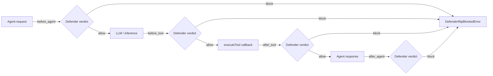

# Branch Summary: `kpannala-microsoft-defender-rtp-public`

> **Pull request:** [#277 — Add opt-in Defender real-time protection client](https://github.com/microsoft/Agent365-nodejs/pull/277)
> **Base branch:** `main`
> **Commit:** `be1f924` — *Add opt-in Defender real-time protection client*

## Overview

This branch adds an **opt-in Microsoft Defender real-time protection (RTP)** capability to the
`@microsoft/agents-a365-tooling` package. It lets an agent submit its requests, responses, and tool
calls to a Defender "third-party (3P) prevention" webhook for a safety verdict **before** and
**after** the agent acts, and to block the action when Defender returns a malicious verdict.

The feature is **disabled by default** and must be explicitly enabled and configured with an
endpoint. When disabled, no tokens are acquired and no network calls are made.

A small, secondary change also lands in the observability package (`ObservabilityManager.start()`
now forwards a few additional builder options), plus a license-header normalization.

> The Defender protocol implemented here is **provisional/draft** and mirrors `agent365-skills`
> PR #78. The `AISession` payload shape is expected to evolve.

## Files changed

| File | Change | Notes |
|------|--------|-------|
| `packages/agents-a365-tooling/src/defender/DefenderRtpClient.ts` | **new (~1004 lines)** | Main client, error types, auth, token cache, payload builder |
| `packages/agents-a365-tooling/src/defender/contracts.ts` | **new (~146 lines)** | Public types/interfaces for requests, results, and auth contexts |
| `packages/agents-a365-tooling/src/defender/index.ts` | **new** | Barrel export for the `defender` module |
| `packages/agents-a365-tooling/src/index.ts` | +1 | Re-exports `./defender` from the package root |
| `packages/agents-a365-tooling/src/configuration/ToolingConfiguration.ts` | +91 | New Defender RTP configuration getters |
| `packages/agents-a365-tooling/src/configuration/ToolingConfigurationOptions.ts` | +25 | Matching override function options |
| `packages/agents-a365-tooling/README.md` | +90 | "Defender real-time protection" usage/config section |
| `packages/agents-a365-observability/src/ObservabilityManager.ts` | ~17 | Forward `exporterOptions`, `serviceNamespace`, `customLogger`; license header fix |
| `package.json` (root) | +2 | `smoke:defender-rtp` and `demo:defender-rtp` scripts |
| `tests/tooling/defender-rtp-client.test.ts` | **new (~531 lines)** | Unit tests (mocked `fetch`) |
| `tests/tooling/configuration/DefenderRtpConfiguration.test.ts` | **new (~92 lines)** | Configuration/env-var tests |
| `tests/observability/core/observabilityBuilder-configProvider.test.ts` | ~19 | Verifies the new `start()` option pass-through |
| `tests/tooling/integration/defender-rtp-agent-demo.mjs` | **new (~190 lines)** | Video-friendly local agent demo |
| `tests/tooling/integration/defender-rtp-live-smoke.mjs` | **new (~154 lines)** | Live smoke test against a real endpoint |

**Total:** 14 files, ~2,362 insertions, ~5 deletions.

## The core feature: `DefenderRtpClient`

`DefenderRtpClient` (exported from `@microsoft/agents-a365-tooling`) wraps the agent lifecycle with
four inspection points and posts a Security4AI `AISession` payload to the configured Defender
endpoint for each.

### Inspection points

| Inspection point | `evaluate*` (non-throwing) | `enforce*` (throws on block) |
|------------------|----------------------------|------------------------------|
| `before_agent`   | `evaluateAgentRequest`     | `enforceAgentRequest`        |
| `after_agent`    | `evaluateAgentResponse`    | `enforceAgentResponse`       |
| `before_tool`    | `evaluateToolRequest`      | `enforceToolRequest`         |
| `after_tool`     | `evaluateToolResponse`     | `enforceToolResponse`        |

- **`evaluate*`** methods return a `DefenderRtpEvaluationResult | null` (`null` when the feature is
  disabled). They never throw on a block verdict.
- **`enforce*`** methods delegate to their `evaluate*` counterpart and throw a
  `DefenderRtpBlockedError` when the action is not allowed.
- **`executeTool(request, auth, execute)`** is a convenience wrapper that runs `before_tool`,
  invokes the supplied `execute()` callback, then runs `after_tool` — throwing if either check
  blocks. When the feature is disabled it simply calls `execute()`.



### Authentication modes

The client accepts a `DefenderRtpAuthenticationContext`, a union of four supported strategies:

1. **`DefenderRtpAccessTokenContext`** — a pre-acquired bearer token (`accessToken`).
2. **`DefenderRtpTokenProviderContext`** — a host-provided callback `getAccessToken(scope)` plus a
   required `tokenScope`.
3. **`DefenderRtpClientCredentialContext`** — direct OAuth client-credentials flow for an
   allowlisted 3P customer app (`tenantId`, `clientId`, `clientSecret`; scope defaults to
   `api://<clientId>/.default`).
4. **`DefenderRtpFmiAuthenticationContext`** — built-in **FMI three-hop** flow (Blueprint →
   Agent Identity): a blueprint client-credentials call obtains an `AzureADTokenExchange`
   assertion (`fmi_path` = agent id), which is then exchanged via
   `urn:ietf:params:oauth:client-assertion-type:jwt-bearer` for the resource token.

All contexts may carry an optional `TurnContext` so identity/correlation fields (agent id, tenant
id, session id, user id, request id) can be resolved from the incoming activity when not supplied
explicitly.

### Token caching

- In-memory `Map` cache keyed by auth-mode + tenant + client/agent + scope.
- **LRU-style eviction** capped at `MAX_TOKEN_CACHE_ENTRIES = 100`.
- **5-minute expiry buffer** (`TOKEN_EXPIRY_BUFFER_MILLISECONDS`) before a cached token's `exp`.
- **In-flight de-duplication** so concurrent requests for the same key share one token acquisition.
- Access tokens are validated (`Utility.ValidateAuthToken`) before use.

### Verdict handling & fail modes

- A verdict of **`blockAction: true`** results in `allowed: false` and, for `enforce*`/`executeTool`,
  a thrown `DefenderRtpBlockedError` (message includes the reason, diagnostics, and correlation id).
- Any transport, authentication, or protocol failure (timeout, non-2xx, non-JSON, missing verdict,
  unavailable token) produces `evaluated: false` and defers to the configured **fail mode**:
  - **fail-open (default):** `allowed: true` — the action proceeds.
  - **fail-closed:** `allowed: false` — the action is blocked.
- Requests are bounded by `AbortSignal.timeout(defenderRtpTimeoutMilliseconds)`.
- A per-call `x-ms-correlation-id` header is sent and echoed back in the result.

### Payload shape

Each evaluation builds a Security4AI **`AISession`** protobuf-JSON object containing:

- `environment.agent` — identity (`a365`, `platform`, optional `entra`), tools metadata, optional
  `llmConfiguration.modelName`, and truncated `instructions`.
- `callerIdentity` — tenant/app ids and a `agent365-sdk-agent/<platform>` user agent.
- `sessionContext.a365.id` — the session id.
- `activities[]` — one activity: `agentRequest` / `agentResponse` / `toolRequest` / `toolResponse`.
- `evaluationPolicy` — `EVALUATION_POLICY_TYPE_BLOCKING` with `THREAT_SCENARIO_TYPE_ALL`.

Message, argument, result, and instruction content is truncated to
`defenderRtpMaxContentCharacters` (default 20,000) with a `...[truncated N chars]` marker.

### Error types

- `DefenderRtpError` — base error (captures an optional `cause`).
- `DefenderRtpBlockedError` — thrown when an action is blocked; carries the full
  `DefenderRtpEvaluationResult`.
- `DefenderRtpValidationError` — thrown for invalid input (missing tool/messages/ids, bad
  argument types, etc.).

## Configuration

New getters on `ToolingConfiguration` (with matching function overrides in
`ToolingConfigurationOptions`), each resolving in order: **override → environment variable →
default**.

| Getter | Env var | Default | Purpose |
|--------|---------|---------|---------|
| `isDefenderRtpEnabled` | `ENABLE_A365_DEFENDER_RTP` | `false` | Master on/off switch |
| `defenderRtpEndpoint` | `A365_DEFENDER_RTP_ENDPOINT` | `''` (throws if enabled) | Webhook URL (required when enabled) |
| `defenderRtpAuthenticationScope` | `A365_DEFENDER_RTP_AUTHENTICATION_SCOPE` | `''` | Optional OAuth resource scope |
| `defenderRtpTimeoutMilliseconds` | `A365_DEFENDER_RTP_TIMEOUT_MILLISECONDS` | `10000` | Per-request timeout (positive int) |
| `defenderRtpFailClosed` | `A365_DEFENDER_RTP_FAIL_MODE` (`closed`) | `false` (fail open) | Behavior when no verdict is available |
| `defenderRtpMaxContentCharacters` | `A365_DEFENDER_RTP_MAX_CONTENT_CHARACTERS` | `20000` | Content truncation limit (positive int) |

Enabling the feature without an endpoint throws:
`defenderRtpEndpoint is required when Defender RTP is enabled.`

## Example usage

```typescript
import {
  DefenderRtpClient,
  ToolingConfiguration,
} from '@microsoft/agents-a365-tooling';

const configuration = new ToolingConfiguration({
  isDefenderRtpEnabled: () => true,
  defenderRtpEndpoint: () => '<defender-rtp-endpoint>',
});

const defender = new DefenderRtpClient({
  configProvider: { getConfiguration: () => configuration },
});

const result = await defender.executeTool(
  {
    agentId,
    tenantId,
    blueprintId,
    sessionId,
    tool: { name: 'send_email', description: 'Sends an email on behalf of the user.' },
    arguments: { to, subject },
  },
  { accessToken },
  () => sendEmail(to, subject),
);
```

## Secondary change: `ObservabilityManager.start()`

`ObservabilityManager.start()` now forwards three additional options to `ObservabilityBuilder`:

- `exporterOptions` → `withExporterOptions(...)`
- `serviceNamespace` → `withServiceNamespace(...)`
- `customLogger` → `withCustomLogger(...)`

The file's license header was also normalized to the standard two-line
`// Copyright (c) Microsoft Corporation. / // Licensed under the MIT License.` form. This change is
independent of the Defender feature.

## Tests

- **`tests/tooling/defender-rtp-client.test.ts`** — comprehensive unit tests using a mocked
  `fetch`, deterministic id factory, and fixed clock. Covers the disabled path, allow/block
  verdicts, fail-open vs fail-closed, validation errors, and `executeTool` wrapping.
- **`tests/tooling/configuration/DefenderRtpConfiguration.test.ts`** — verifies defaults,
  env-var parsing, the "endpoint required when enabled" guard, and scope handling.
- **`tests/observability/core/observabilityBuilder-configProvider.test.ts`** — updated to assert
  the new `start()` options (`serviceNamespace`, `exporterOptions`, `customLogger`) are applied.

## Integration / verification scripts

Two Node ESM scripts (network-dependent, driven entirely by environment variables so no secrets
are hard-coded) plus root `package.json` scripts:

- **`npm run smoke:defender-rtp`** → `tests/tooling/integration/defender-rtp-live-smoke.mjs`
  Builds `runtime` + `tooling`, then runs a benign and a known-bad payload against a live endpoint,
  printing only evaluation metadata (never credentials or content). Supports all four auth modes
  via env vars and can require expected allow/block decisions.
- **`npm run demo:defender-rtp`** → `tests/tooling/integration/defender-rtp-agent-demo.mjs`
  A color-coded, "video-friendly" local agent walkthrough that exercises all four security gates
  across an allowed turn and a blocked turn.

## Security & compliance notes

- **Opt-in and off by default** — no behavioral change unless explicitly enabled and configured.
- **Secrets stay out of source** — live/demo scripts read credentials from the environment and log
  only metadata.
- **No credentials in errors** — `DefenderRtpBlockedError`/failure results expose reason,
  diagnostics, and correlation id, not tokens.
- **Copyright headers** — all new `.ts`/`.mjs` source files include the required Microsoft
  MIT header; no `Kairo` legacy keyword is present.
