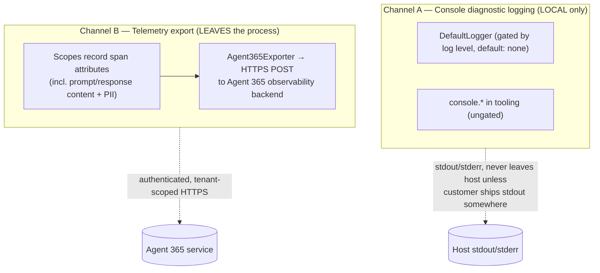

# Logging & Telemetry — Security Review Response

**Subject:** Security-review finding — *"The SDK does not include mechanisms or guidance for scrubbing sensitive information from logs or monitoring logs for abnormal activity."*

**Question being answered:** What does the Agent 365 SDK actually emit/log? What data is captured? Does the finding make sense, and can the issue be closed?

**TL;DR:** The finding is **partially valid**. The SDK has **two distinct emission channels** that must not be conflated:

1. **Console diagnostic logging** — operational metadata only (counts, IDs, durations, errors). **No prompt/response content.** Off by default (`A365_OBSERVABILITY_LOG_LEVEL=none`).
2. **Telemetry export** — OpenTelemetry spans sent to the Agent 365 backend. These **do** contain full prompt/response content and identity/PII, **verbatim with no redaction**, but the exporter is **opt-in and off by default** (`ENABLE_A365_OBSERVABILITY_EXPORTER=false`).

The reviewer's core worry ("sensitive data in logs, no scrubbing") does **not** apply to the console logs, but it **does** point at a real gap in the telemetry path: there is no built-in redaction hook or content-capture opt-out. This is defensible-by-design for an observability product, but it is currently **undocumented**. See [Recommendation](#6-recommendation-can-you-close-it).

---

## 1. The two emission channels

The distinction matters: **Channel A never contains message content**; **Channel B does, but is off unless explicitly enabled.**

---

## 2. Channel A — Console diagnostic logging

### 2.1 The gated `DefaultLogger`

Source: [packages/agents-a365-observability/src/utils/logging.ts](packages/agents-a365-observability/src/utils/logging.ts)

- Writes to `console.log` / `console.warn` / `console.error` — see [logging.ts#L118](packages/agents-a365-observability/src/utils/logging.ts#L118).
- **Gated** by `A365_OBSERVABILITY_LOG_LEVEL`, which **defaults to `none`** (completely silent) — see [ObservabilityConfiguration.ts#L59](packages/agents-a365-observability/src/configuration/ObservabilityConfiguration.ts#L59) and the default logic in [logging.ts#L69](packages/agents-a365-observability/src/utils/logging.ts#L69).
- **Pluggable:** customers can call `setLogger()` to route everything to Winston/Pino/etc. (their own scrubbing/monitoring stack).

**What it logs (metadata only — never prompt/response content):**

| Example | Contains |
|---|---|
| `[Agent365Exporter] Exporting N spans for tenantId: …, agentId: …` | span counts, **tenant GUID, agent GUID** |
| `[EVENT]: EXPORT succeeded in 42ms {…}` | event name, duration, correlation/tenant/agent IDs |
| `Token resolved successfully via tokenResolver` | token-acquisition status (no token value) |
| `Export failed with error: <message>\nStack: …` | error message + stack trace |

The only arguably "sensitive" values here are **tenant/agent GUIDs and correlation IDs** — identifiers, not personal content — and only when the customer explicitly raises the log level.

### 2.2 Ungated `console` usage in Tooling

Two classes log directly to `console`, **bypassing** the log-level gate above:

- **`McpToolServerConfigurationService`** — [logger = console at McpToolServerConfigurationService.ts#L28](packages/agents-a365-tooling/src/McpToolServerConfigurationService.ts#L28). Logs endpoint URLs, send success/failure, request timeouts, and "manifest not found" warnings (e.g. [#L345](packages/agents-a365-tooling/src/McpToolServerConfigurationService.ts#L345)). It logs the **endpoint** and **status**, not the chat-history payload.
- **`PurviewDlpClient`** — two `console.info` calls:
  - [#L108](packages/agents-a365-tooling/src/purview/PurviewDlpClient.ts#L108) — a **`LOCAL_BUILD_MARKER`** banner printed on construction (definition at [#L26](packages/agents-a365-tooling/src/purview/PurviewDlpClient.ts#L26)).
  - [#L804](packages/agents-a365-tooling/src/purview/PurviewDlpClient.ts#L804) — `logEvaluation`, which prints the DLP **decision metadata** (activity, ALLOW/BLOCK, HTTP status, policy-action **count**, correlation ID). It does **not** print the evaluated message content.

> **Hygiene finding (real, but not a data leak):** the `LOCAL_BUILD_MARKER` lines are temporary local-tarball debugging artifacts and are **unconditional** (they ignore `A365_OBSERVABILITY_LOG_LEVEL`). They should be removed or gated before publishing. They emit no personal content, but they are noise and bypass the logging controls.

---

## 3. Channel B — Telemetry export (this is where sensitive data lives)

Source: [packages/agents-a365-observability/src/tracing/exporter/Agent365Exporter.ts](packages/agents-a365-observability/src/tracing/exporter/Agent365Exporter.ts)

- The `Agent365Exporter` serializes OpenTelemetry spans to OTLP-style JSON and **HTTPS-POSTs** them to `…/observability/tenants/{tenantId}/otlp/agents/{agentId}/traces` with a **Bearer token** and `x-ms-tenant-id` header.
- It only runs when **`ENABLE_A365_OBSERVABILITY_EXPORTER=true`** — **default is `false`** — see [ObservabilityConfiguration.ts#L41](packages/agents-a365-observability/src/configuration/ObservabilityConfiguration.ts#L41).

### 3.1 What goes into the span attributes

The scope classes record request/response content and identity onto spans:

- `InvokeAgentScope` records input **and** output content — `recordInputMessages(request.content)` / `recordOutputMessages(response)`.
- The hosting helper feeds the raw user turn text straight in: `scope.recordInputMessages([turnContext.activity.text])` — [ScopeUtils.ts#L35](packages/agents-a365-observability-hosting/src/utils/ScopeUtils.ts#L35).
- The recording helpers set the OTEL gen-ai content attributes — [OpenTelemetryScope.ts#L180](packages/agents-a365-observability/src/tracing/scopes/OpenTelemetryScope.ts#L180) — using keys `gen_ai.input.messages` / `gen_ai.output.messages` ([constants.ts#L58](packages/agents-a365-observability/src/tracing/constants.ts#L58)).

**Inventory of captured attributes:**

| Attribute / field | Source | Sensitivity |
|---|---|---|
| `gen_ai.input.messages` (full prompt text) | `recordInputMessages` | **High — user content** |
| `gen_ai.output.messages` (full model response) | `recordOutputMessages` | **High — model content** |
| Tool call `arguments` / results | `ExecuteToolScope` via `safeSerializeToJson` | **High — arbitrary payloads** |
| Inference `thoughtProcess` | `InferenceDetails` | Medium |
| `userEmail`, `userName`, `userId` | `UserDetails` in [contracts.ts](packages/agents-a365-observability/src/tracing/contracts.ts) | **PII** |
| `agentEmail`, `agentAUID`, `agentBlueprintId` | `AgentDetails` | **PII / identity** |
| Caller **client IP** (`gen_ai.caller.client.ip`) | scope tags | **PII** |
| `tenantId`, `agentId`, correlation ID | identity keys | Identifiers |
| model name, token counts, durations, finish reasons | `InferenceDetails` | Low |

### 3.2 There is no redaction — serialization is verbatim

- `serializeMessages` is a plain `JSON.stringify(wrapper.messages)` — [message-utils.ts#L79](packages/agents-a365-observability/src/tracing/message-utils.ts#L79). No masking, no PII detection.
- `safeSerializeToJson` (tool args/results) likewise just stringifies — [util.ts#L33](packages/agents-a365-observability/src/tracing/util.ts#L33).
- The exporter's `truncateSpan` / `maxPayloadBytes` logic only shrinks spans to fit a **size** budget; it is **not** a sensitivity/redaction control — [exporter/utils.ts](packages/agents-a365-observability/src/tracing/exporter/utils.ts).

**Bottom line for Channel B:** when the exporter is enabled, full prompts, responses, tool payloads, and PII leave the process unmodified. There is currently **no built-in scrubbing hook and no per-field content-capture opt-out** — the only control is the all-or-nothing exporter switch.

---

## 4. Default posture (what ships out-of-the-box)

| Control | Env var | Default | Effect of default |
|---|---|---|---|
| Console diagnostic logging | `A365_OBSERVABILITY_LOG_LEVEL` | `none` | **Silent** — nothing logged |
| Telemetry export | `ENABLE_A365_OBSERVABILITY_EXPORTER` | `false` | **No spans leave the process** |
| Per-request export | `ENABLE_A365_OBSERVABILITY_PER_REQUEST_EXPORT` | `false` | disabled |

So **with default settings the SDK emits essentially nothing**. Sensitive data only flows when a customer both (a) turns on the exporter and (b) records message content. The temporary `PurviewDlpClient` `console.info` markers are the one exception that emits unconditionally (metadata only).

---

## 5. Does the finding make sense?

Point by point against the review text:

| Reviewer claim | Assessment |
|---|---|
| *"Does not include mechanisms for scrubbing sensitive information from logs"* | **Mixed.** True that there is **no redaction hook** on the telemetry (Channel B) content path. **But** the console logs (Channel A) deliberately carry **no message content**, and both channels are **off by default**. So "logs full of unscrubbed PII" is not the out-of-the-box reality. |
| *"…or monitoring logs for abnormal activity"* | **Largely out of SDK scope.** Runtime anomaly detection is a SOC/SIEM/Defender responsibility. The SDK's job is to *emit* well-structured telemetry that such a system consumes — which it does. Reasonable to push back. |
| *"All responsibility is left to the customer"* | **Partly fair as a documentation gap.** The off-switches and `setLogger()` hook exist, but the SDK does not clearly **document** that prompts/responses + PII are captured on export, nor state the shared-responsibility split. |

**Legitimate, actionable gaps surfaced by the review:**

1. **No redaction / content-capture opt-out** for `gen_ai.input.messages` / `gen_ai.output.messages` / tool args on the export path (only the coarse exporter on/off switch).
2. **No documented data-handling guidance** telling customers *what* is captured, *how to disable* it, and *their* scrubbing responsibility.
3. **Temporary `LOCAL_BUILD_MARKER` `console.info`** lines in `PurviewDlpClient` — unconditional, bypass the log-level control, should be removed before release.
4. **Ungated `console` logging** in `McpToolServerConfigurationService` / `PurviewDlpClient` (metadata only, but not routed through the pluggable `DefaultLogger`).

---

## 6. Recommendation: can you close it?

**You can close it — but not as "not applicable."** Close it as **"by design + documentation,"** and to make that defensible, do the low-cost items:

**Should do before closing (low effort, strengthens the position):**
- [ ] **Remove the temporary `LOCAL_BUILD_MARKER` `console.info`** calls in [PurviewDlpClient.ts](packages/agents-a365-tooling/src/purview/PurviewDlpClient.ts#L108) (and the marker at [#L26](packages/agents-a365-tooling/src/purview/PurviewDlpClient.ts#L26) / [#L804](packages/agents-a365-tooling/src/purview/PurviewDlpClient.ts#L804)), or gate them behind the logger. This is a temporary debug artifact and is the most concrete thing a reviewer will point at.
- [ ] **Add a short "Data handling / privacy" section** to the observability README documenting: the default-off posture, the exact attributes captured on export (prompts, responses, tool payloads, PII/IP), how to disable (`ENABLE_A365_OBSERVABILITY_EXPORTER`, `A365_OBSERVABILITY_LOG_LEVEL=none`), how to swap the logger (`setLogger()`), and the customer's responsibility to scrub before recording.

**Reasonable to defer as a future enhancement (note it in the issue):**
- A redaction/transform hook or a `captureContent=false` toggle so message content can be dropped/masked at the source without disabling telemetry entirely.

**Reasonable to decline (state rationale in the issue):**
- Built-in *runtime anomaly monitoring* — that belongs to the customer's SOC/SIEM/Defender pipeline, not the SDK. Note that Channel B already produces the structured telemetry those systems consume, and that the repo also ships the opt-in **Purview DLP** and **Defender RTP** integrations for content inspection.

### Suggested closing comment (draft)

> The SDK exposes two emission paths: (1) console diagnostic logging, which carries only operational metadata (counts, IDs, durations, errors) and is **off by default** (`A365_OBSERVABILITY_LOG_LEVEL=none`), and (2) OpenTelemetry export, which can carry prompt/response content and identity, is **off by default** (`ENABLE_A365_OBSERVABILITY_EXPORTER=false`), and is transmitted over authenticated, tenant-scoped HTTPS to the Agent 365 service. Content capture on the export path is intentional (it is an observability product). We are (a) removing temporary debug log lines, and (b) documenting the captured fields, the disable switches, the pluggable `setLogger()` hook, and the shared-responsibility model. Runtime anomaly monitoring is a SOC/SIEM responsibility consuming this telemetry; content inspection is additionally available via the opt-in Purview DLP and Defender RTP integrations. Closing as **by design + documented**; a source-level content-redaction toggle is tracked as a future enhancement.

---

## Appendix — key source references

| Concern | File |
|---|---|
| Gated console logger + default `none` | [logging.ts](packages/agents-a365-observability/src/utils/logging.ts) |
| Exporter on/off + log-level defaults | [ObservabilityConfiguration.ts](packages/agents-a365-observability/src/configuration/ObservabilityConfiguration.ts) |
| Content serialization (no redaction) | [message-utils.ts#L79](packages/agents-a365-observability/src/tracing/message-utils.ts#L79), [util.ts#L33](packages/agents-a365-observability/src/tracing/util.ts#L33) |
| Records prompt/response onto spans | [OpenTelemetryScope.ts#L180](packages/agents-a365-observability/src/tracing/scopes/OpenTelemetryScope.ts#L180) |
| Raw user turn text captured | [ScopeUtils.ts#L35](packages/agents-a365-observability-hosting/src/utils/ScopeUtils.ts#L35) |
| HTTPS export to Agent 365 backend | [Agent365Exporter.ts](packages/agents-a365-observability/src/tracing/exporter/Agent365Exporter.ts) |
| Captured field definitions (PII) | [contracts.ts](packages/agents-a365-observability/src/tracing/contracts.ts) |
| Temporary debug `console.info` markers | [PurviewDlpClient.ts#L108](packages/agents-a365-tooling/src/purview/PurviewDlpClient.ts#L108) |
| Ungated tooling console logging | [McpToolServerConfigurationService.ts#L28](packages/agents-a365-tooling/src/McpToolServerConfigurationService.ts#L28) |

> Environment defaults cross-checked against the environment-variable table in [CLAUDE.md](CLAUDE.md).
